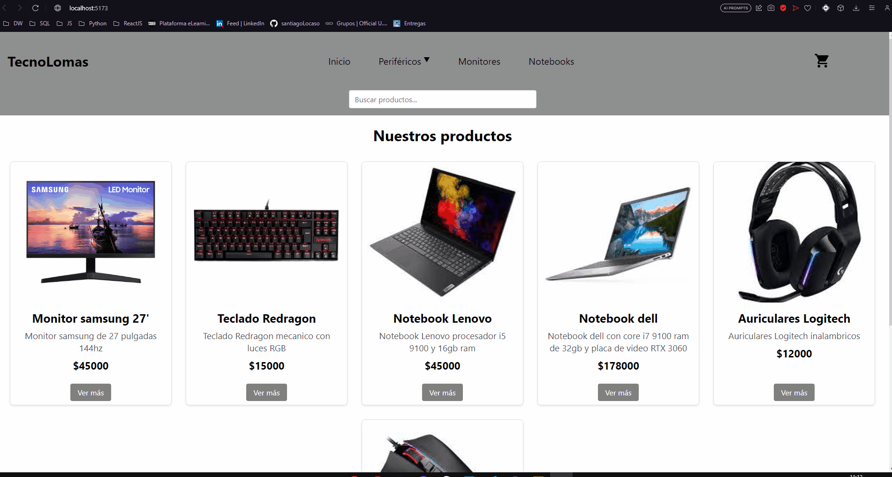

# Proyecto final React JS coderhouse

## Creación con Vite + React de un Ecommerce de productos informaticos

---

### Componentes incluidos en el proyecto:

- Navbar: Este componente renderiza en todas las otras vistas un navbar con las categorias de los productos las cuales redireccionan al usuario al ItemList de la categoria seleccionada, también se muestra el boton al carrito creado en el componente CartWidget.

- SearchBar: Este componente renderiza una barra de buqueda, la cual se muestra en el navbar, en la que el usuario puede buscar cualquier producto y la misma lo redirecciona, con el filtro de categorias, a la categoria del producto buscado

- CartWidget: Este componente renderiza el boton para ir al carrito, junto con un badge que muestra la cantidad de productos dentro de este, el cual redirije al usuario a la vista Cart.

- ItemListContainer: Este componente renderiza todo el listado de productos disponible, extraidos desde la base de datos en firebase, mostrandos en cards creadas en el componente ProductCard, las cuales muestran la foto del producto, su nombre, descripción y su precio, junto con un boton para ver el detalle el cual redirije al usuario al componente ItemDetail.

- ItemDetail: Este componente se renderizan los detalles del producto; su imagen, nombre, descripción, precio y stock. Como tambien los botones para elegir la cantidad que se desea comprar junto con el boton de agregar al carrito, el cual agrega el producto y la cantidad seleccionada al . Este boton con el contador se realiza en otro componente llamado Counter.

- Checkout: Este componente renderiza la vista final para realizar la compra en el momento en el que el usuario realiza click en finalizar compra dentro del carrito, el usuario es redirijido a la vista Checkout en la cual puede visualizar los productos que va a comprar junto con un formulario que solicita los datos de la tarjeta nombre, email y telefono, estos tres ultimos datos son recolectados en una coleccion dentro de firebase para crear la orden de compra con los datos de quien compro y que productos compro. Cuando el usuario rellena el formulario y finaliza la compra a este se le muestra un detalle de la misma con el numero de orden y los productos y la cantidad que compró.

---

### Utilizacion de routes

- Se utiliza react-router-dom para establecer las diferentes rutas del sitio, en este proyecto las rutas establecidas son; home (/), category (/category/:categoryName), detalle (/itemDetail/:id"), cart (/cart), checkout (/checkout) y dashboard (/dashboard), esta ultima se utiliza para cargar los datos de productos a la base de datos en firebase

---

### [Link del proyecto en vercel] (https://react-js-1-rho.vercel.app) 
